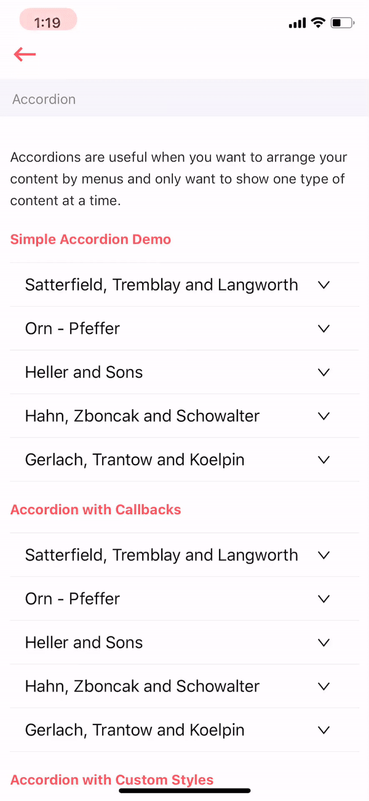

# Accordion

Accordions are useful when you want to arrange your content by menus and only want to show one type of content at a time.



## Usage



```text
import React from 'react'
import Accordion from '../../accordion'

const data = [
    {
        key: '1',
        title: 'Title 1',
        content: 'Content 1'
    }, {
        key: '2',
        title: 'Title 2',
        content: 'Content 2'
    }, {
        key: '3',
        title: 'Title 3',
        content: 'Content 3'
    },
]

var view = function () {
    return (
        <Accordion data={data}/>
    )
}
module.exports = view

```



## Supported properties

| Properties | Descrition | Type | Default |
| :--- | :--- | :--- | :--- |
| data | data to be shown in accordion | array | null |
| ​activeKey | ​current active Panel key | array or string | ​The first panel key on accordion mode |
| defaultActiveKey | default active key | string | null |
| onChange | called when collapse Panel is changed | \(key: string\): void | ​noop |
| styles | to style  title and content  | object | - |

  


