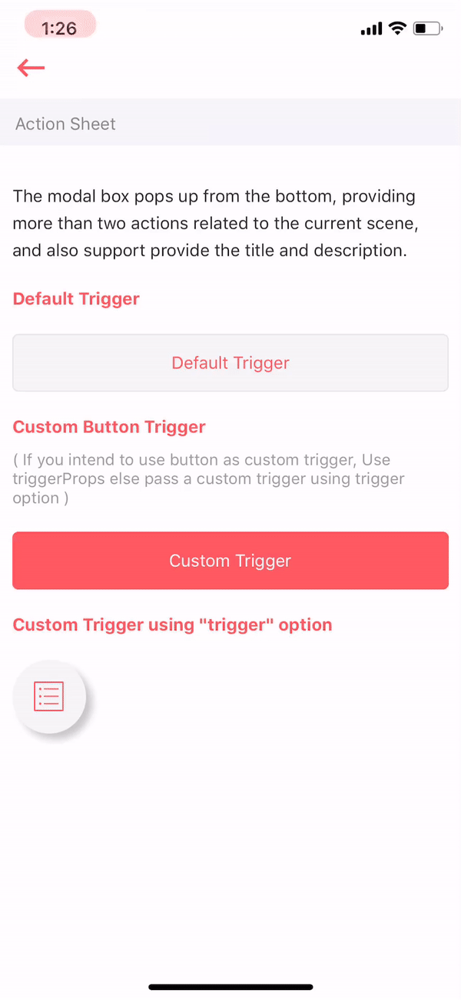

# ActionSheet

The modal box pops up from the bottom, providing more than two actions related to the current scene, and also support provide the title and description.



## Usage



```text
import React from 'react'
import ArivaaActionSheet from '../index'

var view = function () {
    return (
        <ArivaaActionSheet
            title="This is title"
            message="Testing New Message"
            options={[
                {
                    key: '1',
                    title: 'Operation 1',
                    action: this.action
                }, {
                    key: '2',
                    title: 'Operation 2',
                    action: this.action
                }, {
                    key: '3',
                    title: 'Operation 3',
                    action: this.action
                }, {
                    key: '4',
                    title: 'Delete',
                    action: this.action
                }, {
                    key: '5',
                    title: 'Cancel',
                    action: null
                }
            ]}
        />
    )
}
module.exports = view
```



Above code block is the representation of ActionSheet Component in Arivaa. In above code `this.action` is the function \(defined in main.js\) which will be called on click of respective option.



```text
import React, { Component } from 'react'
import ComponentView from './view'
import { Alert } from 'react-native'

export default class Main extends Component {
    constructor (props) {
        super(props)
        this.action = this.action.bind(this)
    }
    
    action () {
        Alert.alert(
            'Button Clicked'
        )
    }
    
    render () {
        return (ComponentView.bind(this))()
    }
}

Main.displayName = 'Action-Sheet-Component-Demo'

```



## Supported properties

| Properties | Descrition | Type | Default |
| :--- | :--- | :--- | :--- |
| title | title of the action sheet | String | "Sample Title" |
| ​message | description of the action sheet | ​String | "Sample Description" |
| options | options to be shown | array | null |

