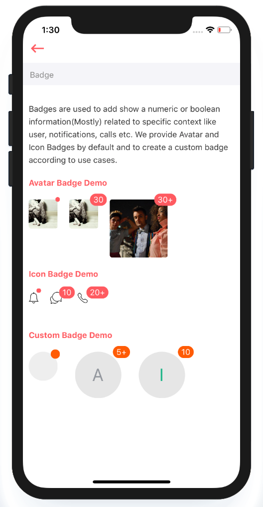

# Badges

Badges are used to add show a numeric or boolean information \(mostly\) related to specific context like user, notifications, calls etc. We provide Avatar and Icon Badges by default and to create a custom badge according to use cases.



## Usage {#supported-properties}



```text
import React from "react";
import styles from "./styles";
import ArivaaBadge from "../../badge";

var view = function () {
    return (
        <ArivaaBadge
            text={30}
            overflowCount={20}
            size={'large'}
            style={styles.badge}
            contentStyle={styles.badgeStyle}
            content={
                <View style={[styles.badgeContent]}>
                </View>
            }
        />
    )
}
module.exports = view

```



## Supported properties {#supported-properties}

| Properties | Descrition | Type | Default |
| :--- | :--- | :--- | :--- |
| size | size of badge, optional: `large` `small` | string | small |
| ​text | text or number inside badge | ​string \| number | - |
| dot | show badge as a red dot | boolean | false |
| overflowCount | max count to show | number | `99` |
| style | styling of the badge | object | - |


