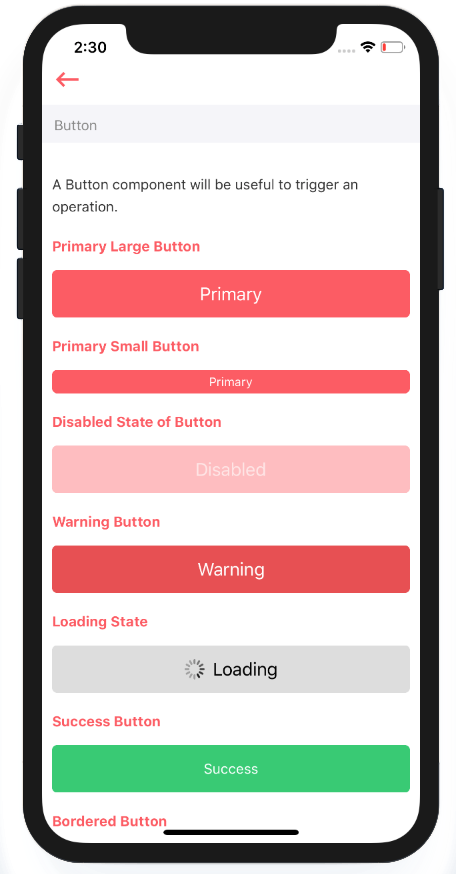

# Button

A Button component will be useful to trigger an operation.



## Usage {#usage}

```text
import React from 'react'
import styles from './styles'
import {View, Text} from 'react-native'
import ArivaaButton from '../index'

var view = function () {
    return (
        <View>
            <ArivaaButton
                type="primary"
                size="large"
                style={[styles.button]}>
                Primary
            </ArivaaButton>
            <ArivaaButton
                type="warning"
                size="large"
                text={'Warning'}
                style={[styles.button]}
                />
        </View>
    )
}
module.exports = view

```

## Supported properties {#supported-properties}

<table>
  <thead>
    <tr>
      <th style="text-align:left">Properties</th>
      <th style="text-align:left">Descrition</th>
      <th style="text-align:left">Type</th>
      <th style="text-align:left">Default</th>
    </tr>
  </thead>
  <tbody>
    <tr>
      <td style="text-align:left">type</td>
      <td style="text-align:left">
        <p>types of button : <code>primary</code>, <code>warning</code>, <code>default</code>, <code>success</code>, <code>bordered</code>, <code>rounded</code> 
        </p>
        <p></p>
        <p><em>For <code>rounded</code> type put single letter or icon inside button. </em>
        </p>
      </td>
      <td style="text-align:left">string</td>
      <td style="text-align:left">default</td>
    </tr>
    <tr>
      <td style="text-align:left">size</td>
      <td style="text-align:left">size of a button. It could either be <code>large</code> or <code>small</code> 
      </td>
      <td style="text-align:left">string</td>
      <td style="text-align:left">large</td>
    </tr>
    <tr>
      <td style="text-align:left">style</td>
      <td style="text-align:left">to add custom styles to button</td>
      <td style="text-align:left">object</td>
      <td style="text-align:left">-</td>
    </tr>
    <tr>
      <td style="text-align:left">disabled</td>
      <td style="text-align:left">boolean to make button disabled</td>
      <td style="text-align:left">boolean</td>
      <td style="text-align:left">false</td>
    </tr>
    <tr>
      <td style="text-align:left">text</td>
      <td style="text-align:left">text to be shown inside a button</td>
      <td style="text-align:left">string | node</td>
      <td style="text-align:left">-</td>
    </tr>
    <tr>
      <td style="text-align:left">loading</td>
      <td style="text-align:left">boolean to show loading state</td>
      <td style="text-align:left">boolean</td>
      <td style="text-align:left">false</td>
    </tr>
    <tr>
      <td style="text-align:left">textStyle</td>
      <td style="text-align:left">adding custom styles to button text</td>
      <td style="text-align:left">object</td>
      <td style="text-align:left">-</td>
    </tr>
  </tbody>
</table>

