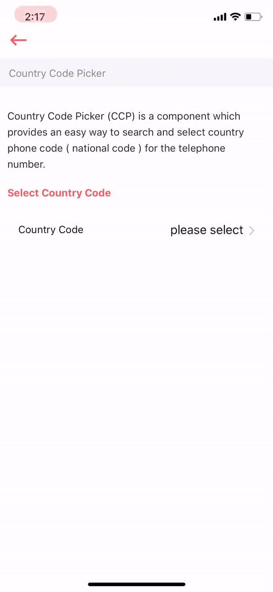

# Country Code Picker

Country Code Picker \(CCP\) is a component which provides an easy way to search and select country phone code \( national code \) for the telephone number.



## Usage {#usage}

```text
import React from "react";
import CountryCodePicker from "../index";

var view = function () {
    return (
        <CountryCodePicker/>
    )
}
module.exports = view

```

## Supported properties {#supported-properties}

| Properties | Descrition | Type | Default |
| :--- | :--- | :--- | :--- |
|  |  |  |  |
|  |  |  |  |


