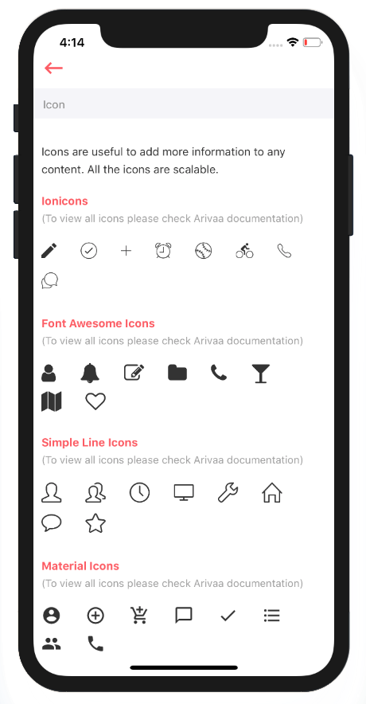

# Icon

Icon component helps you display icons from different icon libraries any where in your application.



We have integrated some of famous icons libraries like Ionicons, Simple line icons, Font Awesome and Material icons. But you can add other libraries as well.

You can find list of all available libraries and icon list at this [link](https://github.com/oblador/react-native-vector-icons)



```text
import React from 'react'
import SimpleLineIcons from '@expo/vector-icons/SimpleLineIcons'
import FontAwesome from '@expo/vector-icons/FontAwesome'
import Ionicons from '@expo/vector-icons/Ionicons'
import MaterialIcons from '@expo/vector-icons/MaterialIcons'

const defaultIconSet = 'ionicons'
const iconMap = {
    'font-awesome': FontAwesome,
    'simple-line-icons': SimpleLineIcons,
    'ionicons': Ionicons,
    'materialIcons': MaterialIcons
}
var view = function () {
    let {type} = this.props
    type = type || defaultIconSet
    let Icon = iconMap[type]
    return (
        <Icon ref={(ref) => {this.refs.icon = ref}} {...this.props}/>
    )

}
module.exports = view
```



Above code block is the representation of Icon component in Arivaa. You can see how we added support of four icon libraries \(from line no. 9 to 12\). So if you wish to add other library you can simply import that library from @expo and mention that in iconMap and it will be available to use. 



```text
import React from 'react'
import SimpleLineIcons from '@expo/vector-icons/SimpleLineIcons'
import FontAwesome from '@expo/vector-icons/FontAwesome'
import Ionicons from '@expo/vector-icons/Ionicons'
import MaterialIcons from '@expo/vector-icons/MaterialIcons'
import NewIconLibraryName from '@expo/vector-icons/New_Icon_Library_Name'

const defaultIconSet = 'ionicons'
const iconMap = {
    'font-awesome': FontAwesome,
    'simple-line-icons': SimpleLineIcons,
    'ionicons': Ionicons,
    'materialIcons': MaterialIcons,
    'newIconLibraryName': New_Icon_library_name
}
```



## Usage

In order to use Icon component in your application, simply import Arivaa Icon Component \(like we did at line no. 4\) and define the type and name of the icon and you will see respective icon in your application. 



```jsx
import React from 'react'
import styles from './styles'
import { View, Text } from 'react-native'
import Icon from '../index'

var view = function () {
    return (
        <View style={[styles.container]}>
            <View style={[styles.section]}>
                <Text style={[styles.title]}>Ionicons</Text>
                <Text style={[styles.message]}>(To view all icons please check Arivaa documentation)</Text>
                <View style={[styles.icons]}>
                    <Icon type="ionicons" style={[styles.icon]} name='md-create'/>
                    <Icon type="ionicons" style={[styles.icon]} name='ios-checkmark-circle-outline'/>
                    <Icon type="ionicons" style={[styles.icon]} name='ios-add'/>
                    <Icon type="ionicons" style={[styles.icon]} name='ios-alarm-outline'/>
                    <Icon type="ionicons" style={[styles.icon]} name='ios-baseball-outline'/>
                    <Icon type="ionicons" style={[styles.icon]} name='ios-bicycle-outline'/>
                    <Icon type="ionicons" style={[styles.icon]} name='ios-call-outline'/>
                    <Icon type="ionicons" style={[styles.icon]} name='ios-chatbubbles-outline'/>
                </View>
            </View>
            <View style={[styles.section]}>
                <Text style={[styles.title]}>Font Awesome Icons</Text>
                <Text style={[styles.message]}>(To view all icons please check Arivaa documentation)</Text>
                <View style={[styles.icons]}>
                    <Icon type="font-awesome" style={[styles.icon]} name='user'/>
                    <Icon type="font-awesome" style={[styles.icon]} name='bell'/>
                    <Icon type="font-awesome" style={[styles.icon]} name='edit'/>
                    <Icon type="font-awesome" style={[styles.icon]} name='folder'/>
                    <Icon type="font-awesome" style={[styles.icon]} name='phone'/>
                    <Icon type="font-awesome" style={[styles.icon]} name='glass'/>
                    <Icon type="font-awesome" style={[styles.icon]} name='map'/>
                    <Icon type="font-awesome" style={[styles.icon]} name='heart-o'/>
                </View>
            </View>
            <View style={[styles.section]}>
                <Text style={[styles.title]}>Simple Line Icons</Text>
                <Text style={[styles.message]}>(To view all icons please check Arivaa documentation)</Text>
                <View style={[styles.icons]}>
                    <Icon type="simple-line-icons" style={[styles.icon]} name='user'/>
                    <Icon type="simple-line-icons" style={[styles.icon]} name='people'/>
                    <Icon type="simple-line-icons" style={[styles.icon]} name='clock'/>
                    <Icon type="simple-line-icons" style={[styles.icon]} name='screen-desktop'/>
                    <Icon type="simple-line-icons" style={[styles.icon]} name='wrench'/>
                    <Icon type="simple-line-icons" style={[styles.icon]} name='home'/>
                    <Icon type="simple-line-icons" style={[styles.icon]} name='bubble'/>
                    <Icon type="simple-line-icons" style={[styles.icon]} name='star'/>
                </View>
            </View>
            <View style={[styles.section]}>
                <Text style={[styles.title]}>Material Icons</Text>
                <Text style={[styles.message]}>(To view all icons please check Arivaa documentation)</Text>
                <View style={[styles.icons]}>
                    <Icon type="materialIcons" style={[styles.icon]} name='account-circle'/>
                    <Icon type="materialIcons" style={[styles.icon]} name='add-circle-outline'/>
                    <Icon type="materialIcons" style={[styles.icon]} name='add-shopping-cart'/>
                    <Icon type="materialIcons" style={[styles.icon]} name='chat-bubble-outline'/>
                    <Icon type="materialIcons" style={[styles.icon]} name='done'/>
                    <Icon type="materialIcons" style={[styles.icon]} name='format-list-bulleted'/>
                    <Icon type="materialIcons" style={[styles.icon]} name='group'/>
                    <Icon type="materialIcons" style={[styles.icon]} name='local-phone'/>
                </View>
            </View>
        </View>
    )
}
module.exports = view

```



## Styling Icons

In order to style icons simply mention your styles in "style" attribute of Icon component

```text
 <Icon type="materialIcons" style={[styles.icon]} name='account-circle'/>
```

And in styles.js

```text
import React from 'react-native'

var styles = React.StyleSheet.create({
    icon: {
        color: '#ff5a60',
        fontSize: 30,
        marginRight: 30,
        marginBottom: 10
    }
})

export default styles

```

