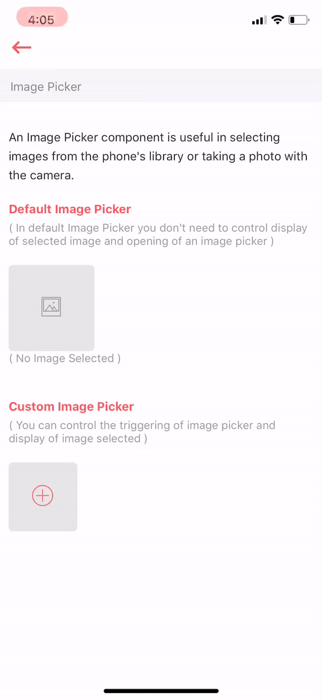

# Image Picker

An Image Picker component is useful in selecting images from the phone's library or taking a photo with the camera.

_Since this component uses Touchable Highlight to provide onPress behaviour, Don't use Touchable Highlight in the children._



## Usage

```jsx
import React from 'react'
import ImagePicker from '../index'

var view = function () {
    return (
        <ImagePicker 
            imageWidth={100} 
            imageHeight={100} 
            imageStyle={[styles.imageStyle]}
        />    
    )
}
module.exports = view

```

## Supported Properties

| Properties | Descrition | Type | Defaul |
| :--- | :--- | :--- | :--- |
| imageWidth | width of the image | number | - |
| imageHeight | height of the image | number | - |
| imageStyle | passing custom style to the image | object | - |
| closable | either to show close icon or not | boolean | false |


