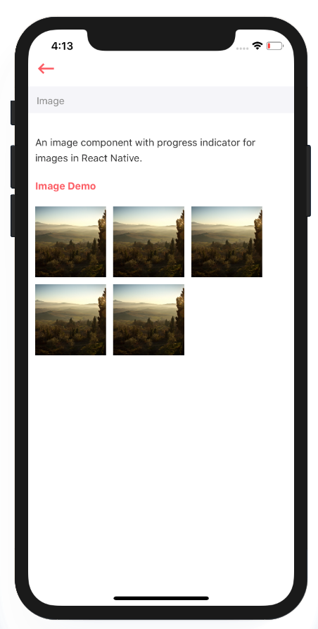

# Image

An image component with progress indicator for images in React Native.



## Usage {#usage}

```text
import React from 'react'
import styles from './styles'
import Image from '../index'

var view = function () {
    return (
        <Image
            style={[styles.image]}
            source={'https://placeimg.com/300/300/any'}
        />
    )
}
module.exports = view

```

## Supported properties {#supported-properties}

| Properties | Descrition | Type | Default |
| :--- | :--- | :--- | :--- |
| source | image source  | string | - |
| style | passing custom style to image | object | - |


