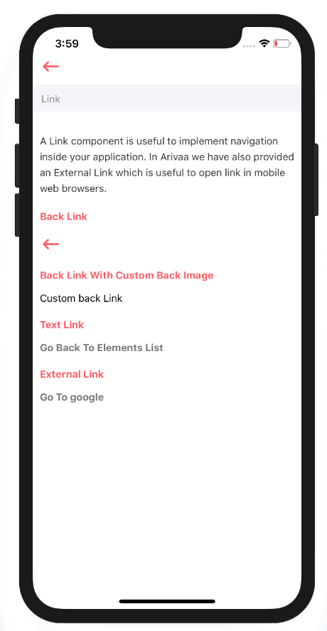

# Link

In Arivaa you will find three types of Link components

1. **Link** Component: It is used to navigate from one screen to another screen within an application.
2. **BackLink** Component: It is used to navigate to previous screen.
3. **ExternalLink** Component: It is used to move from application to external web page.



## Usage



```javascript
import React from 'react'
import styles from './styles'
import { View, Text } from 'react-native'
import Link from '../index'
import BackLink from '../back-link'
import ExternalLink from '../external-link'

var view = function () {
    return (
        <View style={[styles.container]}>
            <View style={[styles.section]}>
                <Text style={[styles.title]}>Back Link</Text>
                <BackLink/>
            </View>
            <View style={[styles.section]}>
                <Text style={[styles.title]}>Text Link</Text>
                <Link
                    link="elements"
                    text="Go Back To Elements List"
                />
            </View>
            <View style={[styles.section]}>
                <Text style={[styles.title]}>External Link</Text>
                <ExternalLink
                    link="https://www.google.com"
                    text="Go To google"/>
            </View>
        </View>
    )
}
module.exports = view


```



## Supported Properties

1. link: It is name of place to which we wish to move.
2. text: It is text to be shown which when pressed do navigate.


