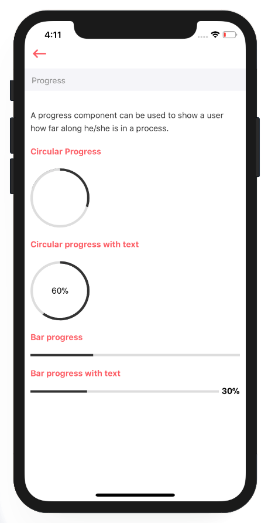

# Progress

A progress component can be used to show a user how far along he/she is in a process.



## Usage

```markup
import React from 'react'
import styles from './styles'
import {View} from 'react-native'
import Progress from '../index'
import {Colors} from 'arivaa-basic/styles'

var view = function () {
    return (
        <View style={[styles.container]}>
            <Progress
                type="circle"
                percent={60}
                radius={50}
                borderWidth={4}
                color={Colors.brandGrey}
                shadowColor="#ddd"
                bgColor="#fff"
            >
                <Text>60%</Text>
            </Progress>
            <Progress
                type="bar"
                percent={30}
                style={{height: 4}}
                barStyle={{borderColor: Colors.brandGrey}}
            />
        </View>
    )
}
module.exports = view

```

## Supported properties {#supported-properties}

| Properties | Descrition | Type | Default |
| :--- | :--- | :--- | :--- |
| type | circle \| bar  | string | bar |
| percent | it represents progress of task | number | - |
| radius | it sets radius of circular component \(applies to circular component only\) | number | - |
| borderWidth | sets the width of border of Progress component \(width of circumference\(in case of circular component\) and width of perimeter\(in case of progress component\). | number | - |
| color | sets the colour of finished region of progress component. | string | - |
| shadowColor | sets the colour of unfinished region of progress component. | string | - |
| bgColor | sets the background colour of progress component. | string | - |


