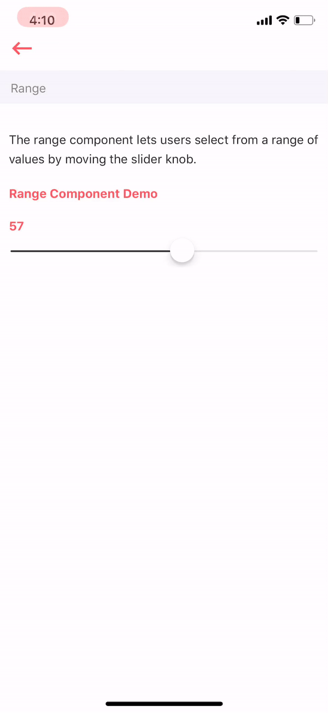

# Range

The range component lets users select from a range of values by moving the slider knob.



## Usage

```javascript
import React from 'react'
import Range from '../index'
import {Colors} from 'arivaa-basic/styles'

var view = function () {
    return (
        <Range
            step={1}
            value={50}
            minimumValue={1}
            maximumValue={100}
            minimumTrackTintColor={Colors.brandGrey}
            maximumTrackTintColor={'#e6e6e6'}
            onChange={this.onChange.bind(this)}
        />
    )
}
module.exports = view

```

## Supported properties {#supported-properties}

| Properties | Descrition | Type | Default |
| :--- | :--- | :--- | :--- |
| step | it is integral value of interval of range. | number | - |
| value | selected value of range by default | number | - |
| minimumValue | it is starting point of range. | number | `0` |
| maximumValue | it is ending point of range | number | `1` |
| minimumTrackTintColor | colour of track which is selected. | string | '\#157cf7' |
| maximumTrackTintColor | colour of track which is not selected | string | '\#b3b3b3' |
| onChange | it is a function called when user changes level. It has a parameter represented new level of the component. | function | - |


