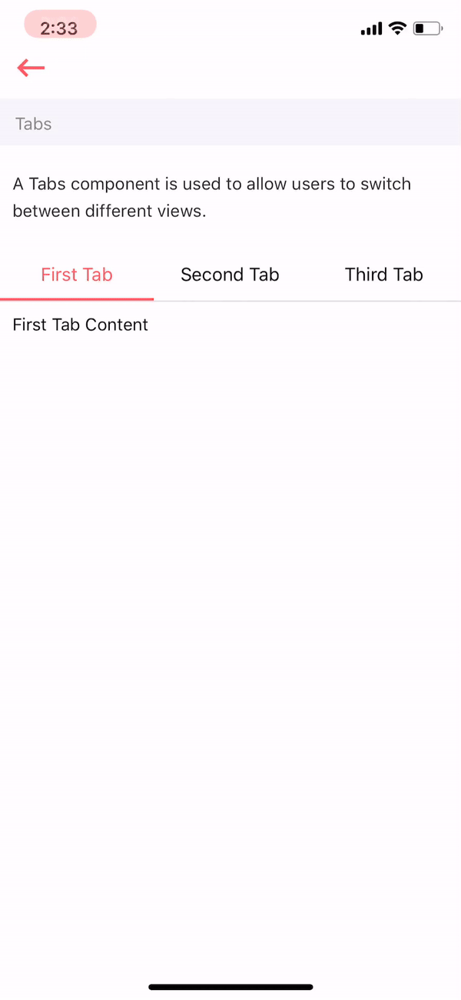

# Tabs

Tab Component is used to switch between different views in your application. Generally a `Tabs` should have 2-4 tab pane, the title of each tab pane should be concise, normally has 2-4 words.





```text
import React from 'react'
import { View } from 'react-native'
import { Tabs } from 'antd-mobile-rn'

var view = function () {
    const {tabs} = this.props
    return (
        <Tabs
            {...this.props}
            tabs={tabs.map((item, index) => {return {title: item.title, key: index}})}>
            {
                tabs.map((item, index) => {
                    return (
                        <View key={index}>{item.content}</View>
                    )
                })
            }
        </Tabs>
    )
}
module.exports = view

```



Above code block is the representation of Tab Component in Arivaa. You can see how we are receiving tab's data as props, which gets rendered via map function and give us complete tab view in the application.

## Usage

In order to use Tabs component in your application, simply import Arivaa Tab Component \(like we did at line no. 3\) and pass tabs data as shown below.



```markup
import React from 'react'
import { View, Text } from 'react-native'
import Tabs from '../index'

var view = function () {
    const tabs = [
        {
            title: 'First Tab',
            content: <View><Text>First Tab Content</Text></View>
        },
        {
            title: 'Second Tab',
            content: <Text>Second Tab Content</Text>
        },
        {
            title: 'Third Tab',
            content: <Text>Third Tab Content</Text>
        }
    ]
    return (
        <View>
            <Tabs
                tabs={tabs}
                tabBarBackgroundColor="#fff"
                tabBarUnderlineStyle={{backgroundColor: Colors.primaryColor}}
                tabBarActiveTextColor={Colors.primaryColor}
            />
        </View>
    )
}
module.exports = view

```



## Supported properties

<table>
  <thead>
    <tr>
      <th style="text-align:left">Properties</th>
      <th style="text-align:left">Descrition</th>
      <th style="text-align:left">Type</th>
      <th style="text-align:left">Default</th>
      <th style="text-align:left">Required</th>
    </tr>
  </thead>
  <tbody>
    <tr>
      <td style="text-align:left">
        <p></p>
        <p>tabs</p>
      </td>
      <td style="text-align:left">
        <p></p>
        <p>It is a array of objects featuring title (title of Tab) and content (renderable
          content of that specific tab).</p>
      </td>
      <td style="text-align:left">array</td>
      <td style="text-align:left"></td>
      <td style="text-align:left">true</td>
    </tr>
    <tr>
      <td style="text-align:left">tabBarPosition</td>
      <td style="text-align:left">TabBar's position</td>
      <td style="text-align:left">'top', 'bottom', 'left', 'right'</td>
      <td style="text-align:left">top</td>
      <td style="text-align:left">false</td>
    </tr>
    <tr>
      <td style="text-align:left">initialPage</td>
      <td style="text-align:left">the tab when inital, index or key</td>
      <td style="text-align:left">number | string</td>
      <td style="text-align:left"></td>
      <td style="text-align:left">false</td>
    </tr>
    <tr>
      <td style="text-align:left">
        <p></p>
        <p>tabBarbackgroundColor</p>
      </td>
      <td style="text-align:left">
        <p></p>
        <p>color of the default tab bar's background</p>
      </td>
      <td style="text-align:left">string</td>
      <td style="text-align:left"></td>
      <td style="text-align:left">false</td>
    </tr>
    <tr>
      <td style="text-align:left">
        <p></p>
        <p>tabBarunderlineStyle</p>
      </td>
      <td style="text-align:left">style of the default tab bar's underline</td>
      <td style="text-align:left">string</td>
      <td style="text-align:left"></td>
      <td style="text-align:left">false</td>
    </tr>
    <tr>
      <td style="text-align:left">
        <p></p>
        <p>tabBarActiveTextColor</p>
      </td>
      <td style="text-align:left">color of the default tab bar's text when active</td>
      <td style="text-align:left">string</td>
      <td style="text-align:left"></td>
      <td style="text-align:left">false</td>
    </tr>
    <tr>
      <td style="text-align:left">tabBarInactiveTextColor</td>
      <td style="text-align:left">color of the default tab bar's text when inactive</td>
      <td style="text-align:left">string</td>
      <td style="text-align:left"></td>
      <td style="text-align:left">false</td>
    </tr>
    <tr>
      <td style="text-align:left">tabBarTextStyle</td>
      <td style="text-align:left">styles to the tab bar's text</td>
      <td style="text-align:left">React.CSSProperties |any</td>
      <td style="text-align:left"></td>
      <td style="text-align:left">false</td>
    </tr>
  </tbody>
</table>Since we are using 'ant-mobile-rn' for Arivaa Tabs components, so to see more supported tabs properties you can refer to this [link](https://mobile.ant.design/components/tabs/)

