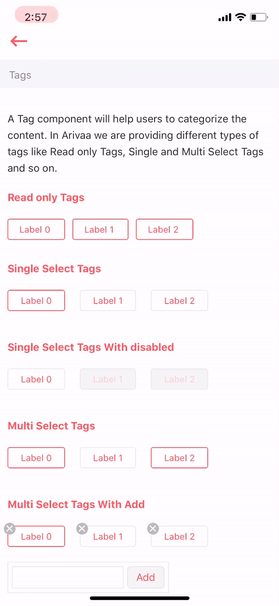

# Tag

A Tag component will help users to categorize the content. In Arivaa we are providing different types of tags like Read only Tags, Single and Multi Select Tags and so on.



## Usage

```markup
import React from "react";
import Tag from "../index";

var view = function () {
    return (
        <Tag
            data={data}
            value={value}
            multiple={true}
            closable={false}
            onChange={this.onChange.bind(this)}
            enableAdd={true}
        />
    )
}
module.exports = view
```

## Supported Properties

| Properties | Descrition | Type | Default |
| :--- | :--- | :--- | :--- |
| data | it is a array of objects consisting of 2 properties\(label and value\) which have to be shown. | array | - |
| value | it is a array of string consisting of values of tags which have to be selected by default. | array | - |
| multiple | it is a boolean indicating whether user can select multiple tags at a time or not. | boolean | false |
| closeable | it is a boolean indicating whether user can delete a tag or not. | boolean | false |
| onChange | it is a function called when user make changes to tags.This function has a parameter containing array of values of selected tags. | function | - |
| enableAdd | it is a boolean indicating whether user can add his/her own tag or not. | boolean | false |

