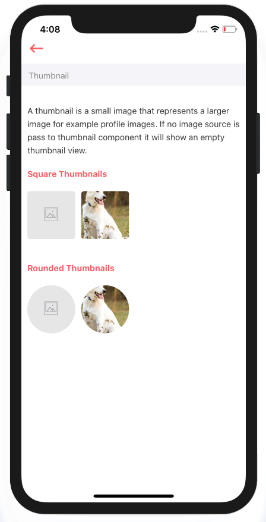

# Thumbnail

A thumbnail is a small image that represents a larger image for example profile images. If no image source is pass to thumbnail component it will show an empty thumbnail view.



## Usage {#usage}

```text
import React from 'react'
import styles from './styles'
import Thumbnail from '../index'

var view = function () {
    return (
        <Thumbnail
            borderRadius={5}
            thumbnailIcon={'ios-image-outline'}
            source={'https://placeimg.com/640/480/any'}
            style={[styles.thumbnail]}/>
    )
}
module.exports = view

```

## Supported properties {#supported-properties}

| Properties | Descrition | Type | Default |
| :--- | :--- | :--- | :--- |
| borderRadius | border radius of thumbnail | number | `0` |
| thumbnailIcon | icon to be shown at center of thumbnail if no image source passed | string | 'ios-image-outline' of Ionicons |
| thumbnailIconStyle | custom style of thumbnail icon | object | - |
| source | image source | string | - |
| style | to pass custom style to thumnail | object | - |


