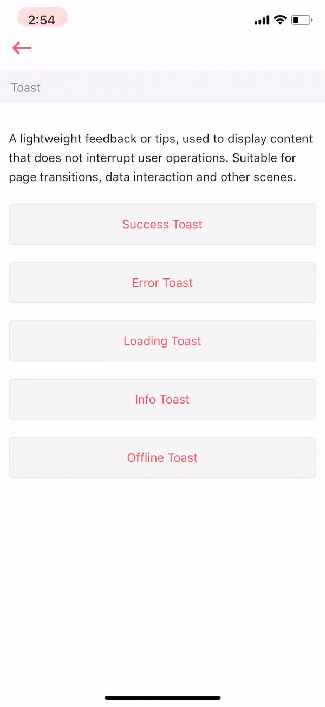

# Toast

A lightweight feedback or tips, used to display content that does not interrupt user operations. Suitable for page transitions, data interaction and other scenes.



## Usage

```markup
import React from 'react'
import styles from './styles'
import {View} from 'react-native';
import ArivaaButton from '../../button';
import Toast from '../index'

var view = function () {
    return (
        <View style={[styles.container]}>
            <View style={[styles.section]}>
                <ArivaaButton type="bordered"
                              onClick={Toast.success.bind(this, "Your account has been created successfully")}>
                    Success Toast
                </ArivaaButton>
            </View>
            <View style={[styles.section]}>
                <ArivaaButton type="bordered" onClick={Toast.fail.bind(this, "Server Error")}>
                    Error Toast
                </ArivaaButton>
            </View>
        </View>
    )
}
module.exports = view

```

## Supported properties

| Properties | Descrition | Type | Default |
| :--- | :--- | :--- | :--- |
|  |  |  |  |
|  |  |  |  |


