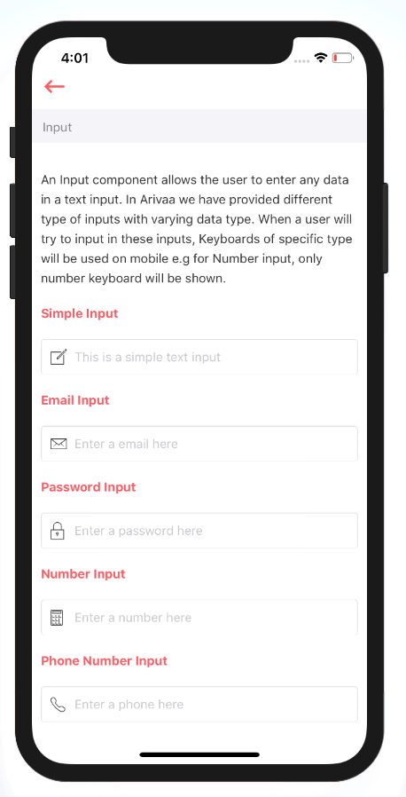

# Input

An Input component allows the user to enter any data in a text input. In Arivaa we have provided different type of inputs with varying data type. When a user will try to input in these inputs, Keyboards of specific type will be used on mobile e.g for Number input, only number keyboard will be shown.



## Usage {#usage}

```text
import React from "react";
import styles from "./styles";
import {Text, View} from "react-native";
import Input from "../index";

var view = function () {
    return (
        <View style={[styles.container]}>
            <View style={[styles.section]}>
                <Text style={[styles.title]}>Simple Input</Text>
                <Input placeholder="This is a simple text input"/>
            </View>
            <View style={[styles.section]}>
                <Text style={[styles.title]}>Email Input</Text>
                <Input type="email" placeholder="Enter a email here"/>
            </View>
            <View style={[styles.section]}>
                <Text style={[styles.title]}>Password Input</Text>
                <Input type="password" placeholder="Enter a password here"/>
            </View>
            <View style={[styles.section]}>
                <Text style={[styles.title]}>Number Input</Text>
                <Input type="number" placeholder="Enter a number here"/>
            </View>
            <View style={[styles.section]}>
                <Text style={[styles.title]}>Phone Number Input</Text>
                <Input type="phone" placeholder="Enter a phone here"/>
            </View>
        </View>
    )
}

module.exports = view

```

## Supported properties {#supported-properties}

| Properties | Descrition | Type | Default |
| :--- | :--- | :--- | :--- |
| type | `email`, `password`, `number`, `phone`  to be pass as type to show respective type of input | string | `null` |
| placeholder | a short hint that describes the expected value of an input field | string | - |


